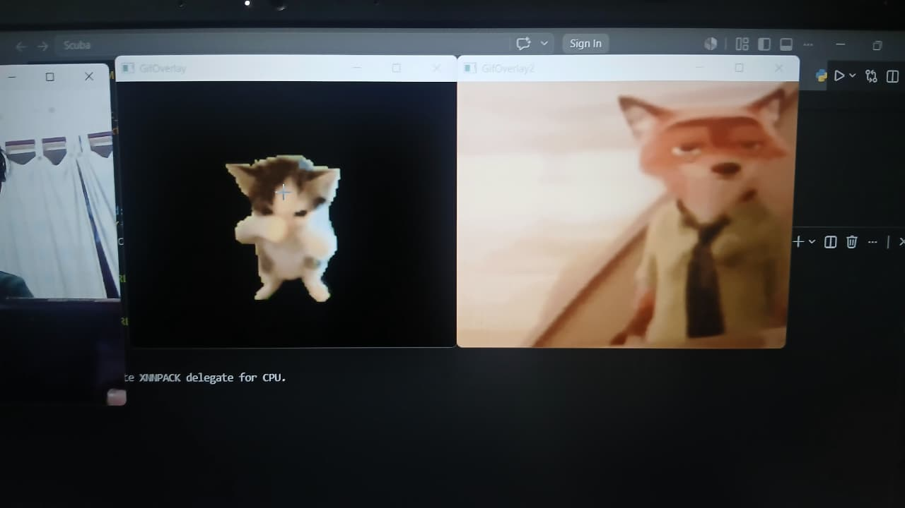

# 🐱 Scuba Cat

> Show your hand. Watch the magic happen.

A real-time computer vision project that detects your hand via webcam and triggers animated GIF overlays that float freely anywhere on your screen — completely outside the camera window.

---

## ✨ Features

- 🖐️ **Hand Detection** — powered by MediaPipe, detects your hand in real time
- 🎞️ **Dual GIF Overlays** — two animated GIFs play simultaneously when a hand is detected
- 🖱️ **Mouse-Following** — GIFs follow your cursor across the entire screen
- 🪟 **Out-of-Window Rendering** — overlays float outside the camera feed using borderless windows
- ⚡ **Always on Top** — GIF windows stay above all other apps

---

## 📁 Project Structure

```
Scuba_Cat/
├── assets/
│   ├── cat_animation.gif
│   └── nick_animation.gif
├── src/
│   ├── __init__.py
│   ├── detector.py        # Hand detection logic (MediaPipe)
│   └── overlay_utils.py   # GIF overlay class
├── main.py                # Entry point
├── .gitignore
└── README.md
```

## Demo



> `__pycache__/` is auto-generated by Python — add it to `.gitignore` to keep your repo clean.

---

## 🚀 Getting Started

### 1. Install dependencies

```bash
pip install opencv-python mediapipe pyautogui numpy
```

### 2. Add your GIFs

Drop your GIF files inside the `assets/` folder and update the paths in `main.py`:

```python
frames_cat = load_gif_frames("assets/cat_animation.gif")
frames_nick = load_gif_frames("assets/nick_animation.gif")
```

### 3. Run it

```bash
python main.py
```

---

## 🎮 How It Works

| Action | Result |
|---|---|
| Show your hand to the camera | Both GIFs appear and animate |
| Move your mouse | GIFs follow your cursor anywhere on screen |
| Hide your hand | GIFs disappear |
| Press `Q` | Quit |

---

## ⚙️ Configuration

Tweak these at the top of `main.py`:

```python
GIF_SIZE = (400, 400)  # Size of each GIF overlay in pixels
```

---

## 🛠️ Built With

- [OpenCV](https://opencv.org/) — video capture & window management
- [MediaPipe](https://mediapipe.dev/) — hand landmark detection
- [PyAutoGUI](https://pyautogui.readthedocs.io/) — global mouse position tracking
- [NumPy](https://numpy.org/) — frame blending & alpha compositing

---

## 📝 Changelog

| Version | What changed |
|---|---|
| `v1.0` | Single GIF overlay inside camera window |
| `v1.1` | GIF moved outside camera using borderless window |
| `v1.2` | Mouse tracking switched to `pyautogui` for global screen position |
| `v1.3` | Dual GIF overlay support for cat and nick animations |

---

👤 Author
Amitava Biswas
